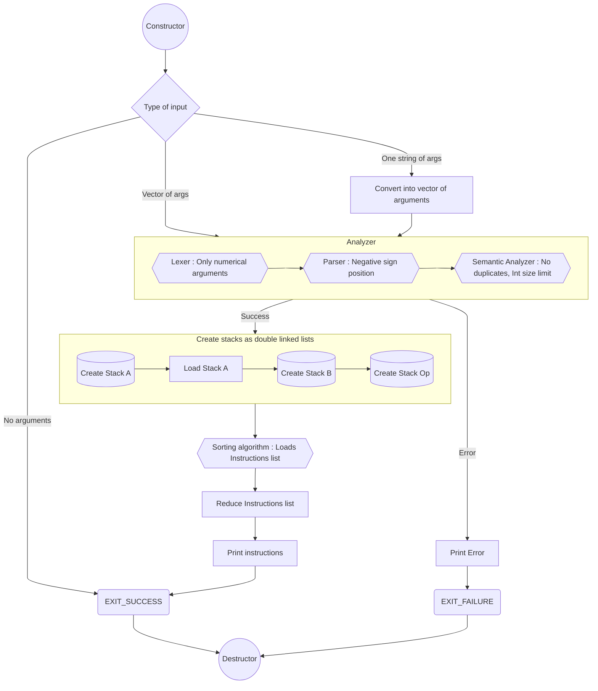

# push_swap

This project is the first encounter with the concept of complexity. A sorting algorithm in the C language using stacks and with limited operations to interact with the stacks to sort the numbers.

The stacks contains a random amount of negative and positive numbers without any duplicates.

The program displays the smallest list of instructions to sort the stack X, having the smallest number at the top.

## Flow Chart


## Operations

let X be the name of the stack (a and b):
ss, rr and rrr: are just two operations in one (sa && sb, ra && rb, ...)
### Swap
swap the first 2 elements at the top of stack X.
- `sX`
- `ss`
### Push
Pass top element from Y and put it on top of X.
- `pX`
### Rotate
Shift up all elements of stack X by 1.
- `rX`
- `rr`
### Reverse rotate
Shift down all elements of stack X by 1.
- `rrX`
- `rrr`

## Build
```bash
make
```

## Usage
```bash
# Multiple arguments
./push_swap [num1] [num2] ... [numN]
# One argument
./push_swap "[num1] [num2] ... [numN]"
```
Which translates into:
| stack X|
|----|
|num1|
|num2|
|...|
|numN|

| stack Y|
|----|
| empty|
| empty|
| empty|
| empty|
## Example
```bash
./push_swap 2 1 3 6 5 8
sa
pb
pb
pb
sa
pa
pa
pa
./push_swap one two 3
Error
```
